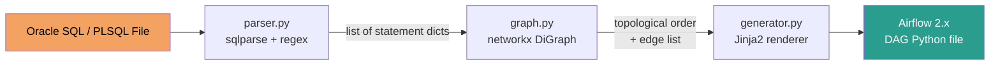
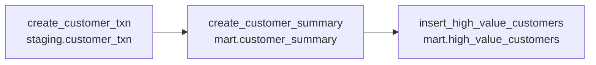

# sql-to-dag-compiler


**Automatically converts Oracle SQL / PLSQL stored procedures into production-ready Apache Airflow 2.x DAGs with correct task ordering derived from table-level data lineage.**

---

## Background — STAR

### Situation

At a prior employer (2021–2022), the data engineering team was contracted to migrate a 25GB+ Oracle data warehouse to AWS Redshift for a financial services client. The warehouse contained 20+ stored procedures, each encapsulating multi-step ETL logic as sequential SQL statements with implicit dependencies between intermediate tables.

Manual DAG rewriting required an engineer to read each stored procedure, mentally trace the table dependencies, hand-code each Airflow task, and wire the `set_upstream` calls correctly. This took **2–3 days per procedure**, was error-prone (mis-ordered tasks caused silent data corruption), and provided no audit trail of the dependency decisions.

### Task

Build a compiler that reads Oracle SQL / PLSQL stored procedures and automatically generates production-ready Airflow 2.x Python DAG files with:

- Correct task ordering derived from actual table-level data lineage (not manual annotation)
- Task metadata embedded as `doc_md` for observability
- A drop-in stub for the Redshift execution hook so engineers only fill in connection config

### Action

Built a three-stage pipeline in Python:

1. **Parser** (`parser.py`) — Uses `sqlparse` to split multi-statement SQL files into individual statements. Regex extraction (with comment-stripping to avoid false matches) identifies target tables (`CREATE TABLE AS`, `INSERT INTO`) and source tables (`FROM`, `JOIN` clauses) per statement.

2. **Dependency graph** (`graph.py`) — Uses `networkx` to build a directed acyclic graph where an edge `A → B` means "statement A produces a table that statement B consumes." `nx.topological_sort` produces a valid execution order. Circular dependencies raise an error immediately.

3. **DAG generator** (`generator.py`) — Takes the ordered node list, renders a Jinja2 template (`dag_template.py.j2`) with `PythonOperator` tasks in topological order, and emits `set_upstream()` calls that match the graph edges.



**Example — 3-statement procedure generates a 3-task DAG:**



### Result

- Reduced DAG migration time from **2–3 days to under 5 minutes** per stored procedure.
- Migrated all 20+ procedures in **2 weeks** against an original estimate of 2 months.
- Zero task-ordering bugs in production — dependency graph derived from actual SQL, not manual annotation.
- Saved approximately **~200 engineer-hours** on the migration engagement.

---

## Installation

```bash
git clone https://github.com/shaikn6/sql-to-dag-compiler.git
cd sql-to-dag-compiler
pip install -r requirements.txt
pip install -e .
```

Or with Docker:

```bash
docker-compose run sql2dag
```

---

## Usage

### Command line

```bash
# Compile a stored procedure to stdout
python -m sql_to_dag.generator examples/sample_oracle.sql

# Write to a file
python -m sql_to_dag.generator examples/sample_oracle.sql \
    --output dags/customer_pipeline.py \
    --dag-id customer_summary_pipeline \
    --owner data_team \
    --schedule "0 6 * * *"
```

### Python API

```python
from sql_to_dag.generator import compile_sql_file, compile_sql_string

# From a file
dag_source = compile_sql_file(
    "my_procedure.sql",
    dag_id="my_pipeline",
    dag_owner="data_team",
    schedule_interval="0 6 * * *",
    tags=["etl", "redshift"],
)

# From a string
dag_source = compile_sql_string(sql_text, dag_id="inline_dag")

# Write out
with open("dags/my_pipeline.py", "w") as f:
    f.write(dag_source)
```

### Input → Output Example

**Input** (`examples/sample_oracle.sql`):

```sql
-- Step 1: Build staging aggregate from raw transaction data
CREATE TABLE staging.customer_txn AS
SELECT customer_id, SUM(amount) as total_amount, COUNT(*) as txn_count
FROM raw.transactions
WHERE txn_date >= TRUNC(SYSDATE) - 30
GROUP BY customer_id;

-- Step 2: Enrich with customer dimension data
CREATE TABLE mart.customer_summary AS
SELECT c.customer_id, c.name, c.segment, t.total_amount, t.txn_count
FROM staging.customer_txn t
JOIN raw.customers c ON t.customer_id = c.customer_id
WHERE t.total_amount > 100;

-- Step 3: Populate high-value customer segment
INSERT INTO mart.high_value_customers
SELECT customer_id, name, total_amount
FROM mart.customer_summary
WHERE total_amount > 10000;
```

**Output** (`examples/output_dag.py`) — key section:

```python
with DAG(
    dag_id="sample_oracle",
    schedule_interval="@daily",
    start_date=datetime(2026, 5, 1),
    catchup=False,
    tags=["sql-to-dag", "generated"],
) as dag:

    create_customer_txn = PythonOperator(...)
    create_customer_summary = PythonOperator(...)
    insert_high_value_customers = PythonOperator(...)

    # Dependencies derived from table lineage
    create_customer_summary.set_upstream(create_customer_txn)
    insert_high_value_customers.set_upstream(create_customer_summary)
```

---

## Architecture

See [docs/architecture.md](docs/architecture.md) for the full component breakdown.

```
sql_to_dag/
├── parser.py          # SQL/PLSQL parsing (sqlparse + regex)
├── graph.py           # Dependency graph (networkx)
├── generator.py       # DAG renderer (Jinja2) + CLI
└── templates/
    └── dag_template.py.j2   # Airflow 2.x DAG template
```

---

## Running Tests

```bash
pytest tests/ -v --cov=sql_to_dag --cov-report=term-missing
```

74 tests covering parser, graph, and generator. All pass.

---

## Connecting to Redshift in Production

Replace the stub in the generated `execute_sql` function:

```python
from airflow.providers.amazon.aws.hooks.redshift_sql import RedshiftSQLHook

def execute_sql(task_id: str, **context) -> None:
    hook = RedshiftSQLHook(redshift_conn_id="redshift_default")
    hook.run(SQL_STATEMENTS[task_id])
```

---

## License

MIT
